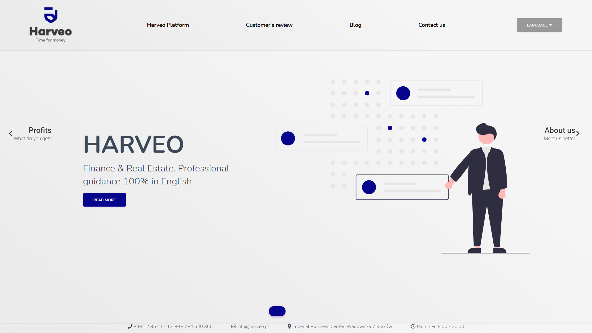
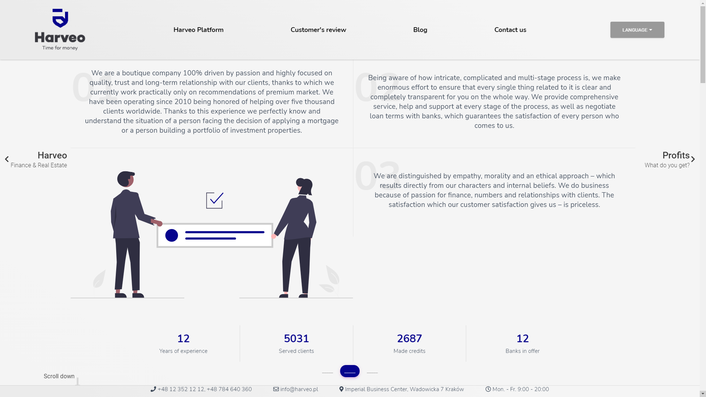
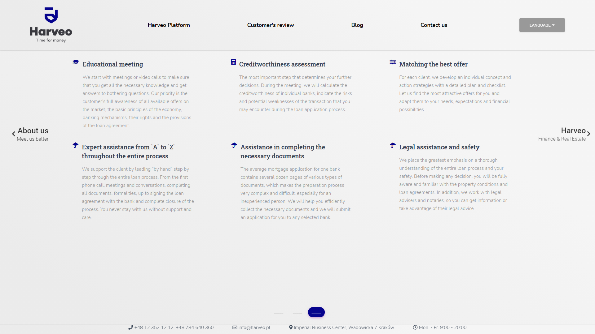

## CHECK IT ONLINE!

https://jakub-tarabasz-harveo.netlify.app/

<p align="center">
  <h3 align="center">HARVEO</h3>
</p>

## About The Project


<br>

<br>

<br>

### Installing

Clone the Repository and run

```
npm install
npm start
```

### Built With

-  React
-  Material Kit React
-  Styled Components
-  GSAP
-  i18next
